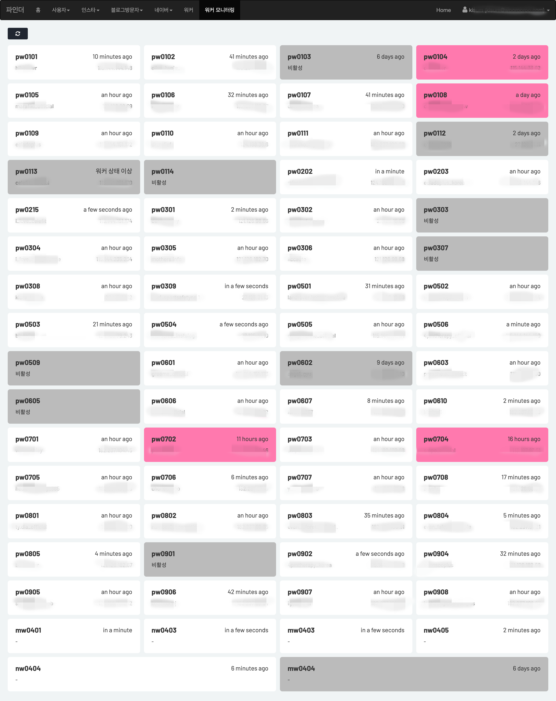
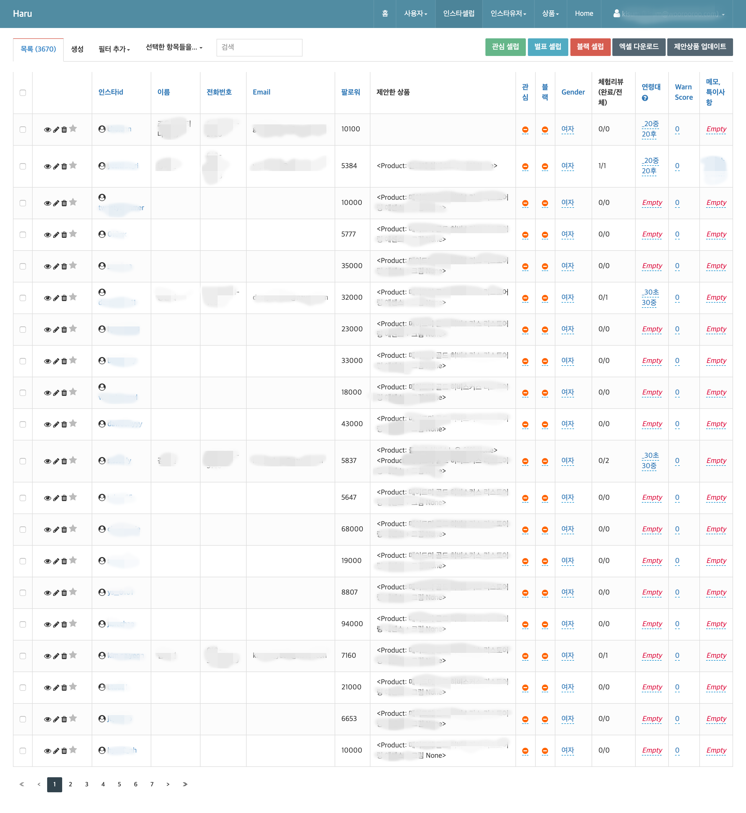
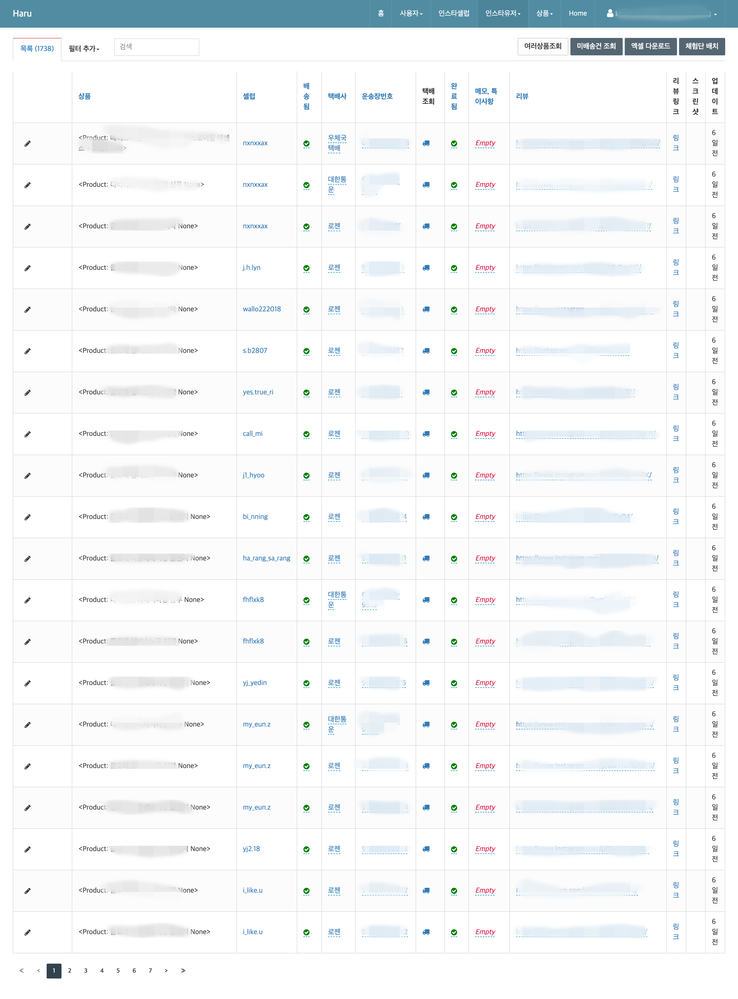
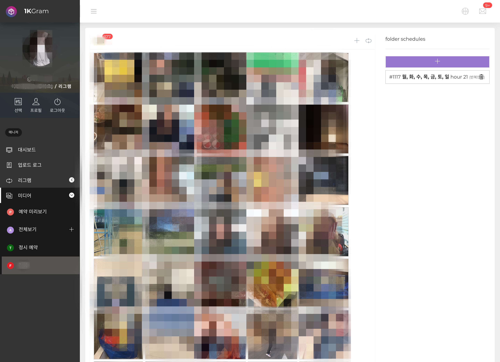
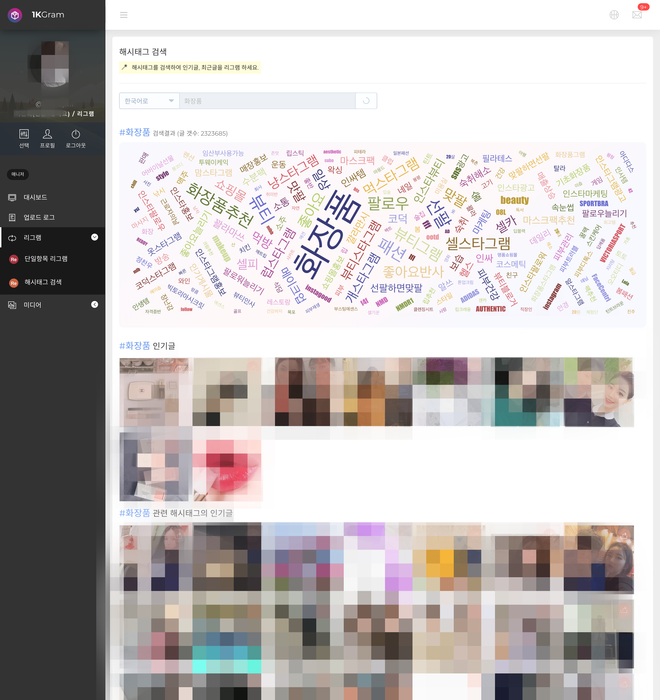
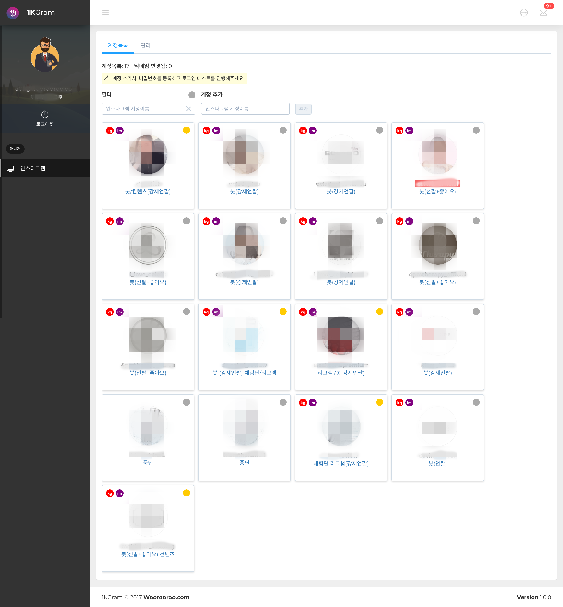
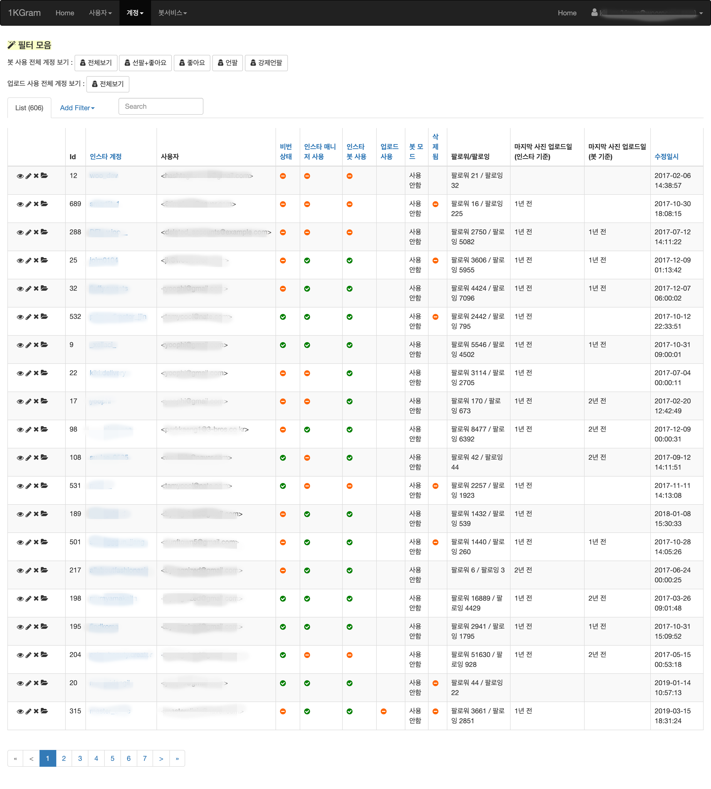
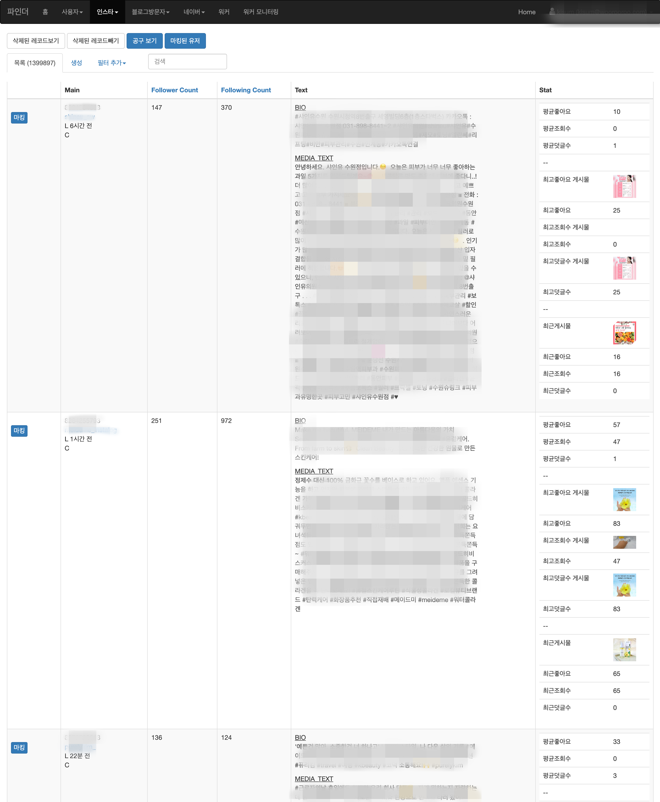

# Resume 2021.9

### [엄지수](https://thumbsu.dev/)
---

안녕하세요, 5년차 프론트엔드 개발자 엄지수 입니다.
 
Javascript와 Python을 이용해 웹, 모바일 앱 등 다양한 개발을 하고 있습니다.

주 언어는 Javascript이나 Typescript에 대한 경험도 있습니다.
 
프론트엔드 쪽으로는 Angular, Vue(Vue.js, Nuxt.js)를 사용하여 개발한 경험이 있습니다.
 
React Native를 사용한 안드로이드와 iOS 앱 개발 프로젝에 참여한 적이 있습니다.
 
백엔드쪽으로는 Python Flask를 사용하여 REST API를 만드는 프로젝트를 진행한 경험이 있습니다.

전반적인 비지니스 로직을 구현하는 데에 어려움이 없고 다양한 팀원과의 협업과 소통을 중시합니다.
 
앞으로 프로젝트 전체를 바라보고 설계할 수 있는 실력을 키우기 위해서 노력하고 있습니다.

## 경력

- **멋쟁이사자처럼**, 서울 강남구 - 코드라이언 개발팀 사원
  (2020년 12월 1일 - 현재)
  > 프론트엔드 개발자로 재직 중입니다.
- **마켓잇**, 서울 성동구 - 개발팀 사원
  (2020년 7월 - 2020년 10월)
  > React Native 모바일 앱 개발자로서 기존에 서비스되고 있던 앱의 유지보수와 기능 추가를 담당했습니다.
- **글로컬라이즈**, 서울 강남구 - R&D팀 사원
  (2019년 7월 - 2020년 6월)
  > 앱 출시 연기로 인한 직무 변경 (**기존**: 모바일 앱 개발자; **변경**: 프론트엔드 개발자)
  > 프론트엔드 개발자로서 클라이언트와 프리랜서 사이를 연결하는 번역 플랫폼의 프론트 개발과 플랫폼을 관리하는 관리자 페이지를 개발했습니다.
- **우루루**, 서울 강남구 — 개발팀 사원
  (2017년 9월 - 2019년 7월)
  > 주니어 소프트웨어 엔지니어로서 사내 프로젝트의 프론트 및 서버 개발에 참여하고, 외주 개발과 크롤링 작업 등을 위한 워커 개발, 서버 관리 등을 했습니다.

## 학력

- **성신여자대학교** — 사학 전공
  (2012년 3월 - 2017년 2월)

## 교육

- **(주)미래능력개발교육원** — NCS 멀티미디어제작 (UI/UX엔지니어링)
  (2016년 12월 - 2017년 9월)

## 프로젝트

### 세렝게티 동물 테스트

- 소속회사명: 멋쟁이사자처럼
- 기간: 2020.12.7 - 2020.12.22
- 주사용기술: Nuxt.js
- 프로젝트 소개: 코드라이언 유저 유입을 유도하기 위한 마이크로 사이트 제작 프로젝트 입니다.
- 수행 역할:
  - Nuxt.js로 사이트 제작
  - SEO, Open Graph 설정
  - 쿠버네티스 배포를 위한 도커라이징 및 ECR 업로드

결과물: [세렝게티 동물 테스트](https://animal.likelion.net)

### Typescript 도입

- 소속회사명: 마켓잇
- 기간: 2020.9 - 2020.9
- 주사용기술: React Native
- 프로젝트 소개: 프로젝트의 규모와 여러 사람의 손을 거쳐간 코드가 많아 유지보수가 어려운 점을 보완하기 위해 Typescript를 도입했습니다. 기존 코드 양이 워낙 많아 점진적 도입이 가능하도록 하였고 ESLint도 이에 맞게 parser를 분리하였습니다.
- 수행 역할:
  - typescript config 작성
  - ESLint의 parser 분리
  - 일부 screen component, store, 공통 component ts 변환

### ESLint, prettier 적용

- 소속회사명: 마켓잇
- 기간: 2020.8 - 2020.8
- 주사용기술: React Native
- 프로젝트 소개: ESLint, prettier가 적용되지 않아 수정할 때마다 불필요한 포맷팅 diff가 생기고 사람마다 기준이 달라서 협 의 후 ESLint와 prettier를 적용했고, husky와 lint-staged를 사용해 커밋 푸시 전 적용되도록 처리했습니다.
- 수행 역할:
  - ESLint config rule 작성
  - prettier 적용
  - sort-import 적용
  - husky와 lint-staged를 사용하여 커밋 푸시 전 rule에 맞게 변환되도록 처리

### React Native 버전 업그레이드

- 소속회사명: 마켓잇
- 기간: 2020.9 - 2020.10
- 주사용기술: React Native
- 프로젝트 소개: iOS14 업데이트 후 사용중이던 React Native 0.61 버전에서 이미지가 보이지 않는 문제가 발생하였고, 이 문제가 0.63 버전에서 해결되었기 때문에 업데이트를 진행하였습니다.
- 수행 역할:
  - React Native 0.61.2에서 0.63 버전으로 업데이트
  - 업데이트 진행 중 발생한 build error 처리

### 번역 플랫폼 프론트 제작

- 소속회사명: 글로컬라이즈
- 기간: 2019.7 - 2020.6
- 주사용기술: Angular(ver.8), NGXS, rxjs, Git(Azure Devops)
- 프로젝트 소개: 번역가와 클라이언트 사이를 이어주는 번역 플랫폼 프로젝트 입니다.
- 수행 역할

  - 프론트엔드 초기 구조부터 NGXS를 사용한 스토어 디자인
  - 로그인, 회원가입, 프로필 등 다양한 페이지 기능 추가
  - 번역가의 핵심성과지표 데이터 시각화
  - wavesurfer.js를 활용한 번역도구 waveform 제작

### 번역 플랫폼 관리자 프론트 제작

- 소속회사명: 글로컬라이즈
- 기간: 2019.7 - 2020.6
- 주사용기술: Angular(ver.8), NGXS, rxjs, Git(Azure Devops)
- 프로젝트 소개: 관리자가 플랫폼의 데이터를 관리하고 번역가의 핵심성과지표 데이터 관리할 수 있는 시스템 프로젝트 입니다.
- 수행 역할
  - 프론트엔드 초기 구조부터 ngxs를 사용한 스토어 디자인
  - 번역가 전체의 핵심성과지표 데이터 시각화
  - 각종 데이터 CRUD 제작

### 건축 관련 사이트 아카아키(외주)

- 소속회사명: 우루루
- 기간: 2019.2 - 2019.3
- 주사용기술: Nuxt.js, Vuex, SCSS, Flask, PostgreSQL, SQLAlchemy, Docker, Git
- 프로젝트 소개: 건축에 관련된 건축회사, 인테리어회사, 자재회사 등 회사들의 포트폴리오와 건출물에 대한 모든 정보(사용 자재, 인테리어, 참여 회사 등)를 확인할 수 있는 핀터레스트 형식의 건축 사이트를 만드는 외주 프로젝트 입니다. 서버는 Flask로 REST API와 관리자 페이지를 제작하였고 프론트는 Nuxt로 제작하였습니다.
- 수행 역할
  - 서버: SQLAlchemy ORM을 사용하여 초기 DB Model 구성하고 Admin 페이지를 제작
  - 프론트: Nuxt를 사용하여 SPA로 제작. 초기 세팅부터 전체적인 View 구성 및 제작, UI 퍼블리싱, REST API를 호출하여 실데이터 연결까지 전담하여 작업

결과물: [아카아키](http://akaaki.kr/)

### 미대 입시 학생들을 위한 어플 그리미(외주)

- 소속회사명: 우루루
- 기간: 2017.6 - 2017.10 (1차) / 2018.9 - 2019.4 (2차)
- 주사용기술: React Native, TypeScript, Redux, SCSS, Flask, PostgreSQL, SQLAlchemy, Docker, Git
- 프로젝트 소개: 미대 입시를 준비하는 학생들을 위해 인스타그램처럼 자유롭게 자신의 그림을 올리고 앱에 가입한 다른 사용자들(학원 선생님 혹은 학생들)에게 평가를 받을 수 있고 미술학원 정보나 대학의 정보를 얻을 수 있는 SNS형 어플 외주 프로젝트 입니다. 서버는 Flask로 REST API와 관리자 페이지를 제작하였고 앱은 React Native로 제작하였습니다.
- 수행 역할
  - 서버: (1차) 학원 관리자 페이지 화면 수정 및 버그 수정, (2차) 새 기능을 위한 DB Model 추가, REST API 작성, 관리자 페이지 수정
  - 프론트: (1차) 메인 홈 화면 디자인, 각종 화면 버그 수정, (2차) 팔로우 피드, 유저간 팔로우, 팔로우 리스트, 게시물 스크랩 및 분야별 평가, 게시판, 설정 화면 및 프로필 페이지 등 전반적인 화면 구성 및 제작, REST API를 호출하여 실데이터 연결, Google Map 연결까지 대부분을 전담하여 제작

결과물:

- ~~[안드로이드](https://play.google.com/store/apps/details?id=kr.co.threebros.greeme)~~
  _(현재 안드로이드는 마켓에서 내려간 상태 입니다.)_
- [아이폰](https://itunes.apple.com/kr/app/%EA%B8%B8%EB%A6%AC%EB%AF%B8/id1188971676?mt=8)

### 워커 세팅 자동화 및 모니터링 시스템 (사내)

- 소속회사명: 우루루
- 기간: 2019.4 - 2019.7
- 주사용기술: Flask, Flask-admin, Vue.js, Vuex, PostgreSQL, SQLAlchemy, Redis, bee-queue, Node.js, crontab
- 프로젝트 소개 및 수행 역할: 기존에 서버마다 들어가서 워커의 상태를 확인하고 마케팅 계정을 세팅하고 작업을 시작시키던 일련의 수동 작업들을 전부 자동화하는 프로젝트 입니다. 워커의 개수가 수동으로 관리하기에는 너무 많아져 전체적인 세팅 과정과 복구 작업을 자동화시키고 작업의 과정과 결과를 모니터링하면서 워커를 관리하는 부분까지 재정비하였습니다.

결과물:

### 체험단 관리 시스템 (사내)

- 소속회사명: 우루루
- 기간: 2018.4 - 2019.7
- 주사용기술: Flask, PostgreSQL, SQLAlchemy, Celery, Docker, Git
- 프로젝트 소개: 마케팅팀에서 업무를 좀 더 효율적으로 할 수 있도록 도움을 주고, 일의 결과물들이 각자의 엑셀 파일로 흩어져 없어지지 않도록 하기 위한 관리 시스템을 만드는 프로젝트 입니다. 서버는 Flask로 제작하였고 관리자 페이지를 만들어서 사내에서 사용 중입니다.
- 수행 역할
  - 서버: 관리자 페이지 화면 수정 및 각종 버그 수정, 체험단 계정 정보의 업데이트를 위한 작업

결과물:

### SNS 마케팅 관리 시스템 (사내)

- 소속회사명: 우루루
- 기간: 2017.12 - 2018.7
- 주사용기술: Vue.js, Vuex, Flask, PostgreSQL, SQLAlchemy, Docker, Celery, Git
- 프로젝트 소개: SNS 계정 관리를 위한 작업물 업로드와 계정 관리 작업을 상세 설정하고 결과를 확인할 수 있는 SNS 마케팅 관리툴을 만드는 프로젝트 입니다. SNS에 업로드할 이미지들을 폴더별로 정리하고 이미지마다 같이 업로드될 글을 작성할 수 있으며 폴더별 예약 업로드, 개별 업로드 예약 등의 기능들이 있습니다. 서버는 Flask로 REST API와 관리자 페이지를 제작하였고 프론트는 Vue.js를 사용하여 제작하였습니다.
- 수행 역할
  - 서버: 버그 수정 및 유지보수, 관리자 페이지 수정, 워커 세팅 자동화
  - 프론트: 기존의 Angular로 되어있던 프론트를 Vue.js로 재작성, UI 퍼블리싱, 데이터 바인딩

결과물:

#### 프론트

#### 서버

### 크롤링 시스템 (사내)

- 소속회사명: 우루루
- 기간: 2018.1 - 2019.7
- 주사용기술: Flask, PostgreSQL, SQLAlchemy, Celery, Docker, Git
- 프로젝트 소개: 사내에서 필요한 각종 SNS 데이터들의 주기적인 수집과 전체적인 작업 현황을 보기 위한 크롤링 시스템을 만드는 프로젝트 입니다. Flask로 관리자 페이지를 제작하였고 Celery를 사용하여 주기적 작업을 만들어 관리하고 있습니다.
- 수행 역할
  - 서버: 버그 수정 및 유지보수, 관리자 페이지 수정, 다른 사내 시스템의 서버에서 크롤링이 필요한 계정 정보를 받아 업데이트 하는 기능, 크롤링 및 계정 관리등의 전체적인 워커 작업 현황을 보고 관리할 수 있는 기능(원페이지 Vue.js)

결과물:

### 크롤링 및 마케팅 서포트 작업을 위한 워커 (사내)

- 소속회사명: 우루루
- 기간: 2017.12 - 2019.7
- 주사용기술: Node.js, Selenium, Webdriver, Redis, pm2, crontab
- 프로젝트 소개: 각종 SNS 정보 크롤링과 SNS 계정 관리를 위한 워커를 제작하는 프로젝트 입니다.
- 수행 역할: SNS 계정 관리 작업 및 크롤링 작업 모듈 제작과 유지보수, 워커 세팅 자동화를 맡아서 작업했습니다.

### 중앙 작업 분배 시스템 (사내)

- 소속회사명: 우루루
- 기간: 2017.12 - 2019.7
- 주사용기술: Node.js, bee-queue, hapi.js, Redis, Sequelize.js
- 프로젝트 소개: 크롤링 및 마케팅 계정 관리 작업 등의 모든 작업들을 한곳에서 관리하고 워커들이 자신의 일을 가져갈 수 있도록 분배하는 시스템을 만드는 프로젝트 입니다. 서버는 Node Hapi.js로 제작하였습니다.
- 수행 역할: 각종 작업들을 redis에 넣는 api와 작업 워커들의 현황을 별도로 redis에 담아 작업이 정상적으로 진행되고 있는지 확인할 수 있는 시스템을 만드는 작업을 했습니다.

결과물: [swagger](http://job.blacklatte.net/documentation)

